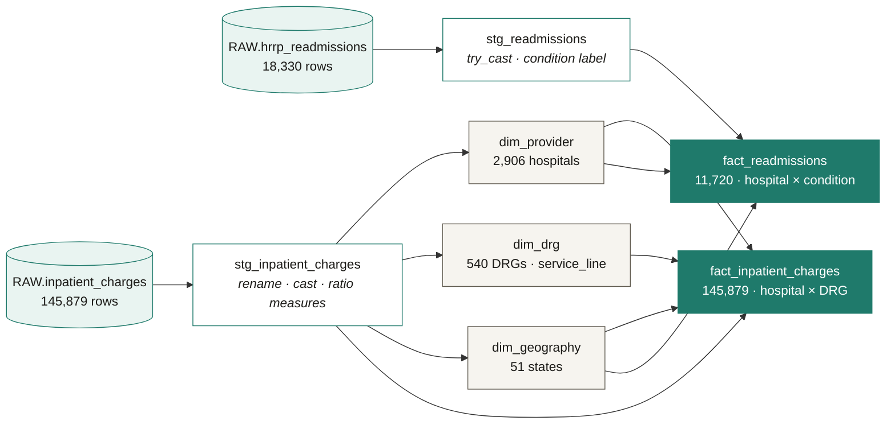

# Lineage

The dbt DAG from raw CMS tables through staging to the two-fact star. GitHub renders the mermaid graph below; `dbt docs generate && dbt docs serve` produces the interactive version locally.

**Reading it:** two raw CMS extracts → two staging views → the marts. `dim_provider` feeds **both** facts — that's the conformed key (CCN) that makes cost-vs-quality possible. The cross-fact `relationships` test in `dbt/models/marts/_schema.yml` enforces that every `fact_readmissions.provider_sk` resolves in `dim_provider`.

See [`results/dbt_run.log`](../results/dbt_run.log) and [`results/dbt_test.log`](../results/dbt_test.log) for the build that produced these row counts (7 models, 19/19 tests passing).
